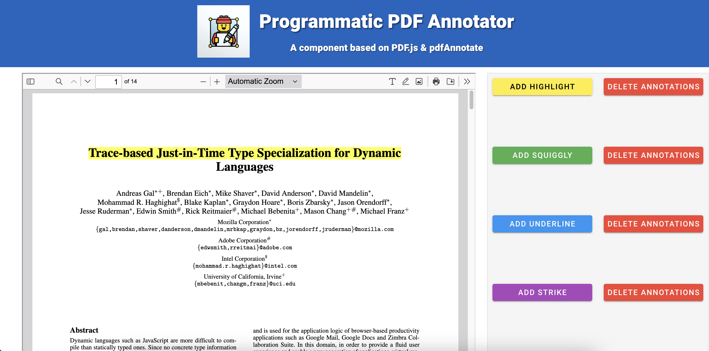
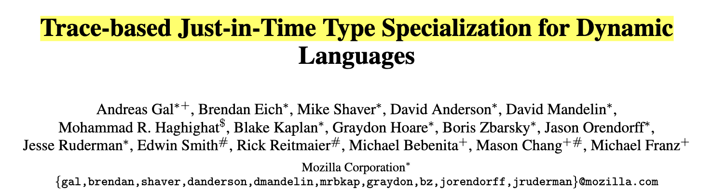
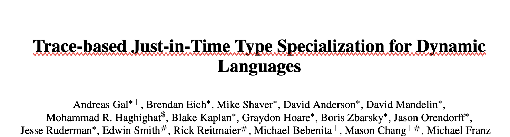
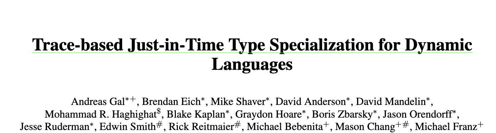
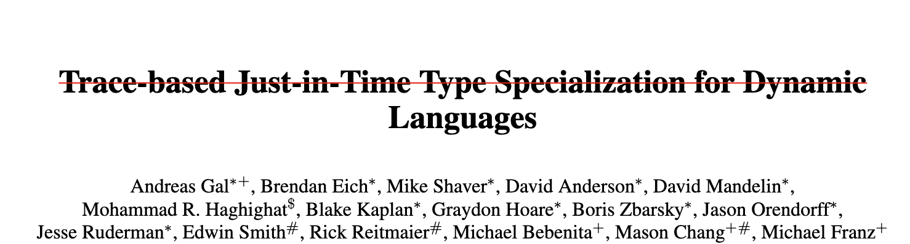
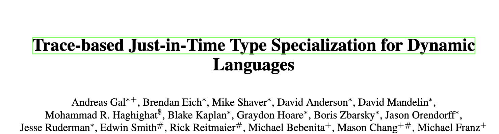
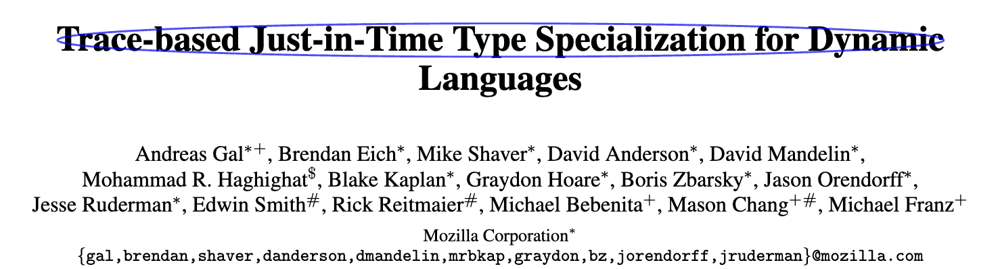

## PDF Annotator

Welcome to the PDF Annotator project! This project is built using Vue.js, PDF.js, and pdfAnnotate to provide a robust solution for viewing and annotating PDF documents. Whether you're a developer looking to integrate PDF viewing and annotation capabilities into your application or just exploring the capabilities of these powerful libraries, this guide will walk you through everything you need to get started.

As someone who found the documentation of PDF.js insufficient and faced significant challenges in programmatically adding annotations to PDF documents using a dedicated backend and database, I decided to create this project. Working with the annotation layer of PDF.js was very challenging and almost impossible to accomplish this task. Therefore, I created this small project to showcase the easiest production-level solution ([pdfAnnotate](https://github.com/highkite/pdfAnnotate)) I found for programmatic annotation and demonstrate how you can easily integrate the prebuilt PDF.js viewer into your Vue project.

<p align="center">
    
</p>

### Table of Contents

1. [Getting Started](#getting-started)
   - [Using Docker](#using-docker)
   - [Manual Setup with NPM](#manual-setup-with-npm)
2. [Integrating PDF.js Viewer](#integrating-pdfjs-viewer)
3. [Annotating PDFs with pdfAnnotate](#annotating-pdfs-with-pdfannotate)

## Getting Started

### Using Docker

Setting up the project using Docker ensures a consistent environment and simplifies dependency management. Follow these steps to get started:

1. **Clone the Repository**
   ```sh
   git clone https://github.com/your-repo/pdf-annotator.git
   cd pdf-annotator
   ```

2. **Build the Docker Container**
   ```sh
   docker build -t pdf-annotator .
   ```

3. **Run the Docker Container**
   ```sh
   docker run -p 5173:5173 -v $(pwd):/app pdf-annotator
   ```

4. **Access the Application**
   Open your browser and navigate to `http://localhost:5173` to see the application in action.

### Manual Setup with NPM

If you prefer setting up the project manually using NPM, follow these steps:

1. **Clone the Repository**
   ```sh
   git clone https://github.com/your-repo/pdf-annotator.git
   cd pdf-annotator
   ```

2. **Install Dependencies**
   ```sh
   npm install
   ```

3. **Run the Development Server**
   ```sh
   npm run dev
   ```

4. **Access the Application**
   Open your browser and navigate to `http://localhost:5173` to see the application in action.

## Integrating PDF.js Viewer

The `pdfViewer.vue` component integrates the default/prebuilt PDF.js viewer using an `iframe`. The fastest way to intergate pdfjs with your component is to use their prebuilt component. Discliamer: be cautious, the PDFjs team explicitly asks you "we do ask if you plan to embed the viewer in your own site, that it not just be an unmodified version. Please re-skin it or build upon it.". So be cautious about their terms and agreements.

Here's how simple integration with iframe works:

1. **Integration of PDFjs in Vue component via `iframe`**
   ```html
   <template>
     <div>
       <iframe ref="pdfViewerIframe" id="pdfViewer" :src="viewerUrl"></iframe>
     </div>
   </template>
   ```

2. **Break Down the Key Aspects**

- **Iframe Source**: set the iframe's `src` to the path of the PDF.js viewer HTML file.
- **Iframe ID**: assigned the iframe an ID of `pdfViewer` for easy interaction with its content.
- **PDF Loading**: `loadPDF` and `iframeLoader` functions handle fetching and preparing the PDF, which is then loaded into the iframe.
- **Below are the major API calls to pdfjs and their functions**:
    - **`PDFViewerApplication`**: This is the main class in viewer.mjs that we interact with, controlling rendering and sub-functionalities.
        - `PDFViewerApplication.open(file)`: Used to load the PDF. Pass a Uint8Array instead of a URL.
        - Ensure to decode base64 encoded data before passing it -- not all browsers support atob or data URI schemes.
    - **`value.contentWindow.PDFViewerApplication`**: Accesses the DOM content.
    - **`PDFViewerApplication.pdfDocument`**: Initializes interaction with the DOM content.
    - **`PDFViewerApplication.pdfDocument.getData()`**: Retrieves data from the DOM for operations like client-side annotation and rendering.
    - **`PDFViewerApplication.initialized`**: Checks if the viewer is initialized and ready for rendering.
    - **`PDFViewerApplication.eventBus`**: Enables the event bus of pdfjs.
    - **`PDFViewerApplication.eventBus.on("pagechanging")`**: Listens for page changes in the PDF


## Annotating PDFs with pdfAnnotate

The `annotPdf.vue` component leverages the [pdfAnnotate](https://github.com/highkite/pdfAnnotate) library to add various types of annotations to PDF documents. The intergation of this library for programmatic annotations at least on PDFjs is seamless.
* Note: I personally tested this library in production with dedicated backend working with huge amounts of data in json format, so it's reliable. The only bug I found was that setting the appearance flag to "hidden" ony works on highlight annotation, while it's supposed to work on other markup annotations as well.
* A huge thanks to [pdfAnnotate](https://github.com/highkite/pdfAnnotate) for creating such a great tool with reliable documentation (more documentation than the entire pdfjs project, Haha!)

Here's how you can use it:

### Available Annotations

The `pdfAnnotate` library supports several types of annotations, including:
- Highlight
<p align="center">
    
</p>
- Squiggly
<p align="center">
    
</p>
- Underline
<p align="center">
    
</p>
- Strikeout
<p align="center">
    
</p>
- Square
<p align="center">
    
</p>
- Oval
<p align="center">
    
</p>
- and more

### Parameters Required

Each annotation type requires at least the following parameters:
- **page**: The page number where the annotation should be added.
- **rect**: The rectangle coordinates `[x1, y1, x2, y2]` defining the annotation's position.
- **contents**: The content of the annotation.
- **author**: The author of the annotation.
- **color**: The color of the annotation in `{ r, g, b }` format.
- **opacity**: The opacity of the annotation.

for details and the rest of the documentation, I urge you to read their entire documentation at [pdfAnnotate](https://github.com/highkite/pdfAnnotate).

* Note: one thing you need to be cautious is that pdfjs origin for a "rect" is top left, and pdfAnnotate origin is buttom left, so you need a simple conversion of "y" coordinates to create the list of your annotations.


Thank you for using the PDF Annotator project! We hope this guide helps you get the most out of your PDF viewing and annotation capabilities. Happy coding!